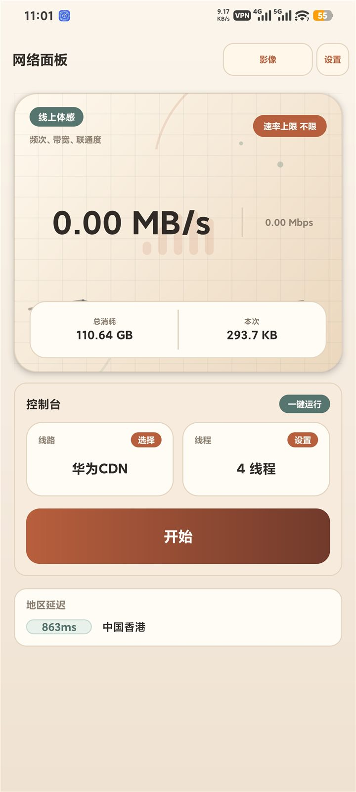
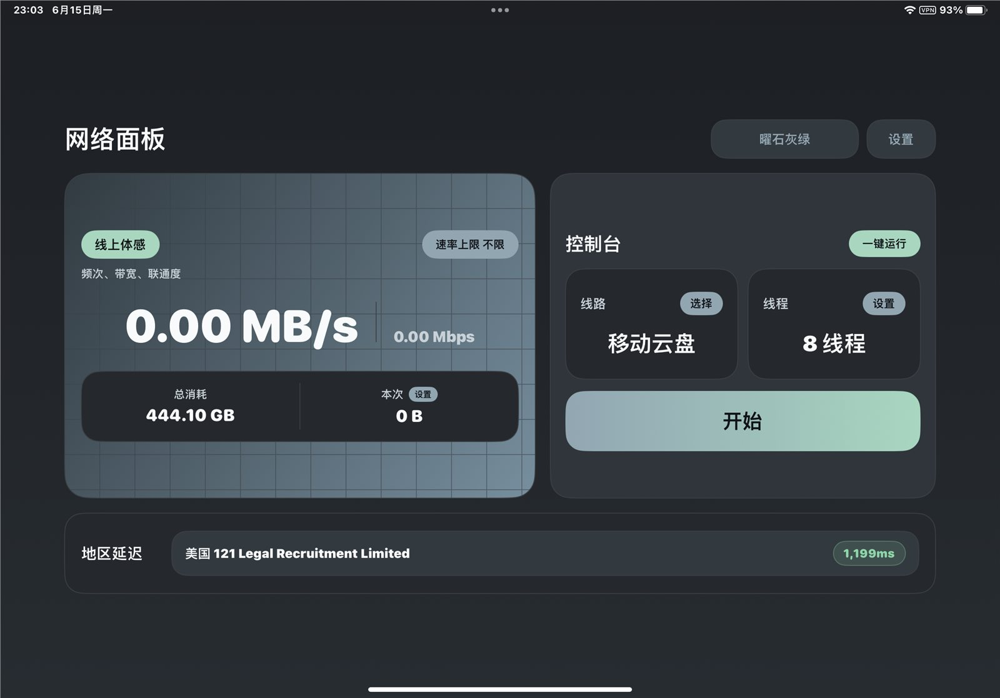

# 网络面板 Android

网络面板是一个原生 Android 网络工具，用于查看实时速率、管理测试线路、记录数据用量，并辅助判断当前网络连接质量。应用采用原生 Java 实现，支持多主题、地区延迟检测、通知栏控制和后台运行相关设置。

## 功能

- 实时速率显示：同时展示 `MB/s` 与 `Mbps`，便于快速观察当前网络吞吐状态。
- 数据用量统计：分别记录累计用量与本次会话用量，支持 TB 级显示和手动清零。
- 线路管理：支持添加、选择、编辑和删除测试地址，适合对比多条网络线路的可用性。
- 并发线程设置：可调整运行线程数，便于在不同网络环境下进行强度控制。
- 速率与用量上限：支持设置速率上限和本次会话用量上限，避免占用过多带宽。
- 地区延迟检测：自动检测可用地区节点延迟，检测不到时不会展示无效数据。
- 后台与通知栏：支持锁屏运行、增强并发和通知栏操作按钮。
- 多主题外观：内置多套浅色、深色和季节配色主题。
- GitHub Actions 构建：推送版本标签后可自动构建并发布 APK。

## 界面预览

<p>
  
  
  
</p>

<p>
  
</p>

<p>
  
</p>

## 下载安装

游客可以在 GitHub Release 页面直接下载最新版 APK：

[下载最新版 APK](https://github.com/youko-nobody/network-panel/releases/latest)

## 相关项目

- Android 项目：[youko-nobody/network-panel](https://github.com/youko-nobody/network-panel)
- iOS 项目：[youko-nobody/network-panel-ios](https://github.com/youko-nobody/network-panel-ios)

## 构建说明

推荐使用 Android Studio 打开项目，或使用 Gradle Wrapper 构建。

Windows PowerShell：

```powershell
.\gradlew.bat assembleDebug
```

macOS / Linux：

```bash
./gradlew assembleDebug
```

生成的 debug APK 位于：

```text
app/build/outputs/apk/debug/
```

## 发布说明

正式 APK 应使用本地 keystore 签名，签名文件和密码不要提交到仓库。详细步骤见：

[docs/RELEASE.md](docs/RELEASE.md)

## 开源内容

本仓库包含：

- 原生 Android Java 源码
- Gradle 构建配置
- GitHub Actions 构建和发布流程
- MIT License
- 贡献、安全、隐私和发布说明

本仓库不包含：

- APK / AAB 构建产物
- keystore / 签名证书 / 密码
- 本地配置文件
- 参考 APK 拆包内容
- 私人截图或个人信息

## 注意

网络面板不包含广告 SDK、统计 SDK 或第三方追踪服务。后台持续运行能力受 Android 系统策略、设备厂商、电量模式和网络环境影响，实际表现可能因设备而不同。更多说明见 [PRIVACY.md](PRIVACY.md)。

## License

MIT License. See [LICENSE](LICENSE).
